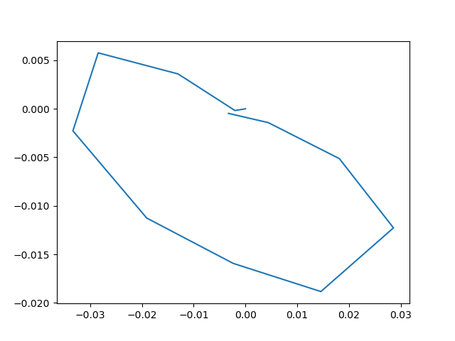
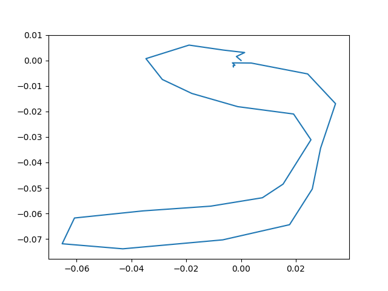

# Driving_Data_Collection_Test
This repository shows how to get combined IMU, GPS, and Video data for ORB-SLAM2 verification testing

## Steps to run

Attached the ```IMU +  GPS``` Module onto the vehicle as shown below:

Attach the camera to face forwards in such an angle as to grab features

### There are three main scripts to run:

#### Video Capture:

        conda activate tf_env1
        python capture_video.py

#### IMU Data:

- Check for ```COM Ports``` (Windows), or ```/dev/tty``` ports on Linux.
- Ensure correct code is flashed onto the micro-controller
- If on Windows, Run anaconda as admin. On Linux, make the port executable by typing the following:
        
        sudo chmod a+rw /dev/ttyUSB0
        OR
        sudo chmod a+rw /dev/ttyUSB1

- Enter the respective test number in utils.py

        python save_tum_file.py

#### GPS:

- Check for ```COM Ports``` (Windows), or ```/dev/tty``` ports on Linux.
- If on Windows, Run anaconda as admin. On Linux, make the port executable by typing the following:
        
        sudo chmod a+rw /dev/ttyUSB0
        OR
        sudo chmod a+rw /dev/ttyUSB1
        
- Ensure correct code is flashed onto the micro-controller
- Enter the respective test number in utils.py

        python gps_read.py

## Hardware Setup

The setup is shown below:

IMU and GPS Setup

<p align="center">
  
</p>

IMU and GPS Setup
<p align="center">
  
</p>

Camera Setup

<p align="center">
  
</p>

## Obtained Graphs

The obtained plots are shown below:

<p align="center">
  
</p>

<p align="center">
  
</p>

<p align="center">
  
</p>


## PYTHON CODE LOOKUP TABLE

| Serial Number| Code  | Function | Arduino Code Flashed |
| ------------- | ------------- | ------------- |------------- |
| 1 |  *capture_video.py*| To capture the video |- |
| 2 | *capture_video_linux.py* | To capture video for Linux and straight away convert to image sequences | - |
| 3 |  *save_tum_file.py*| To save the IMU Data in quaternion format the video | IMU_QUATERNION |
| 4 |  *gps_read.py*| To read the GPS Data | GPS_LONGITUDE_LATITUDE_TEST |
| 5 |  *global_gps2xy.py*| To convert the raw GPS data from Text file to XY Coordinates |- |
| 6 | *Interpolate_GPS.py*| To interpolate the GPS Data to match with IMU Data lines |- |
| 7 | *utils.py* | Contains utility variables | - |

The TUM format files can be run using the command

        evo_traj tum Test_3_TUM_FORMAT.txt --plot_mode xz --plot
